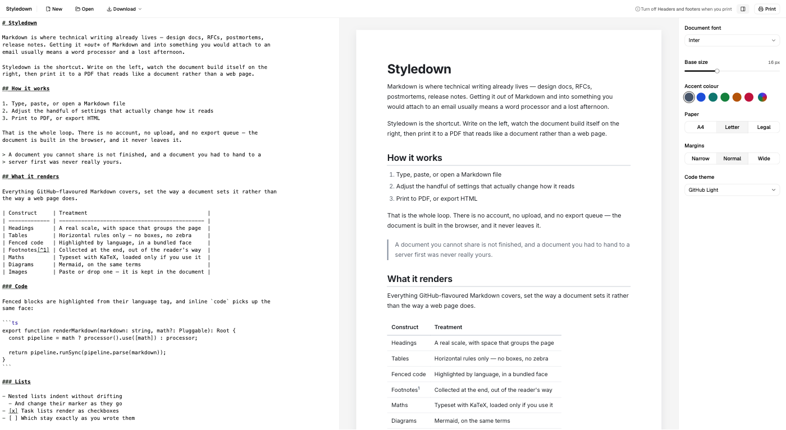
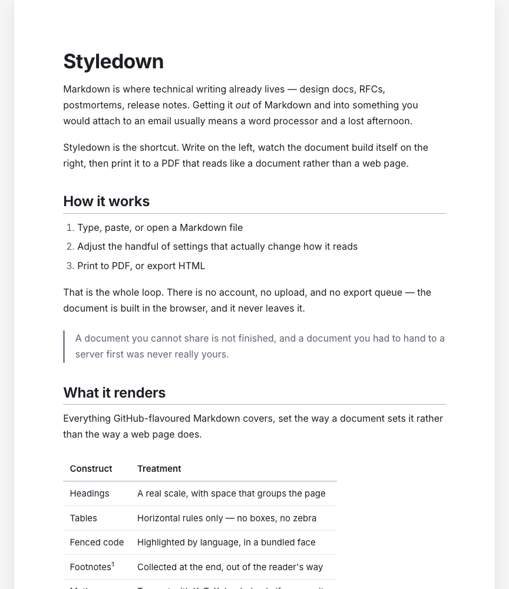
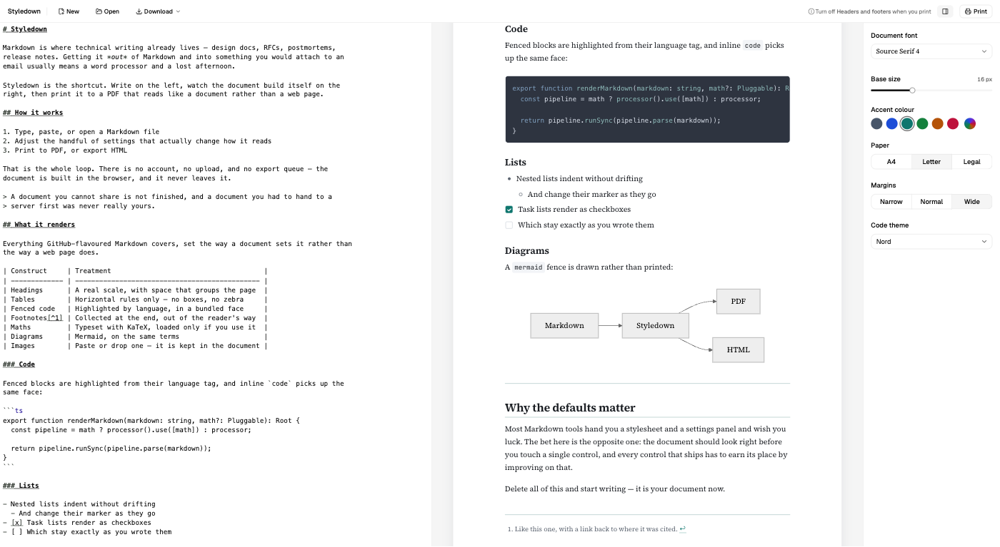

# Styledown

Turn Markdown into print-ready documents, entirely in your browser.

**[Try it →](https://ddanielcruz.github.io/styledown/)**



Markdown is where technical writing already lives — design docs, RFCs, postmortems, release notes. Getting it _out_ of Markdown and into something you would attach to an email usually means a word processor and a lost afternoon. Styledown is the shortcut: write on the left, watch the document build itself on the right, then print it to a PDF that reads like a document rather than a web page.

It is an open-source rebuild of an earlier personal project.

## What it does

- **A default that already looks good.** Real typography before you touch a single control — heading scale, spacing rhythm, tables set with rules instead of boxes.
- **GitHub-flavoured Markdown**, including tables, task lists, footnotes and autolinks.
- **Syntax highlighting** for fenced code, and **maths** typeset with KaTeX — loaded only if your document has some.
- **Mermaid diagrams**, drawn from a ` ```mermaid ` fence and carried into the PDF and the exported file as real SVG.
- **Images by paste or drop**, downscaled and kept inside the document itself — there is nowhere else to put them.
- **PDF via the browser's own print**, plus HTML and Markdown export.
- **Five controls, not fifty**: document font, base size, accent colour, page setup, code theme.



### The document is the product

The page on the right is the whole bet. Most Markdown tools hand you a stylesheet and a settings panel and wish you luck; here the document is meant to look right before you touch anything, and every control that ships has to earn its place by improving on that.

So the typography is fixed where it should be — the heading scale, the spacing rhythm, the way a table is set — and open only where a real document genuinely differs: its typeface, its size, its accent, its paper, its code theme.

<br clear="all" />



## Privacy

Your document is rendered in the browser and never transmitted. There is no account, no sync, and no analytics.

Everything the app needs ships in the bundle — the five typefaces, all six code themes, the diagram renderer — so there is no third party in the render path and no CDN to trust. What we promise is about **content**: what you write stays on your machine, including the images you paste into it.

## Stack

React + TypeScript on Vite, [unified](https://unifiedjs.com) (remark/rehype) for the Markdown pipeline, CodeMirror for the editor, Tailwind and shadcn/ui for the app chrome. No backend, and no plans for one.

The document's own typography is plain, unlayered CSS in [`src/styles/document.css`](src/styles/document.css) — deliberately not Tailwind, so the HTML exporter can inline it as text.

Developed and verified in Chrome, which is also the only browser whose print engine the PDF work is measured against.

## Development

Requires Node (see [`.nvmrc`](.nvmrc)) and pnpm.

```bash
pnpm install
pnpm dev
```

| Command            | What it does                           |
| ------------------ | -------------------------------------- |
| `pnpm dev`         | Dev server                             |
| `pnpm build`       | Production build to `dist/`            |
| `pnpm test`        | Vitest — `lib` (node) and `ui` (jsdom) |
| `pnpm lint`        | oxlint                                 |
| `pnpm check-types` | `tsc --noEmit`                         |
| `pnpm format`      | oxfmt                                  |

Some things a test cannot see — whether a PDF paginates cleanly, whether the default document looks good. Those are checked by driving a real Chrome: [`scripts/print-to-pdf.mjs`](scripts/print-to-pdf.mjs) prints through the real controls, [`scripts/measure-pdf.mjs`](scripts/measure-pdf.mjs) reads the paper and margins back out of the file, and [`scripts/screenshot.mjs`](scripts/screenshot.mjs) takes the pictures above.

[`CONTRIBUTING.md`](CONTRIBUTING.md) has the rest, including the two rules that are not negotiable.

## Design

[`docs/DESIGN.md`](docs/DESIGN.md) is the only design doc: the decisions, the data model, and the build order. It is kept current rather than supplemented.

## License

MIT — see [`LICENSE`](LICENSE).
